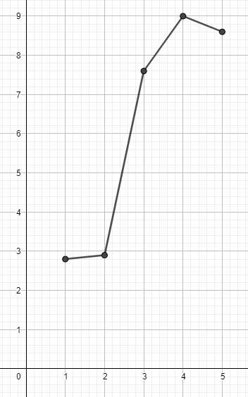
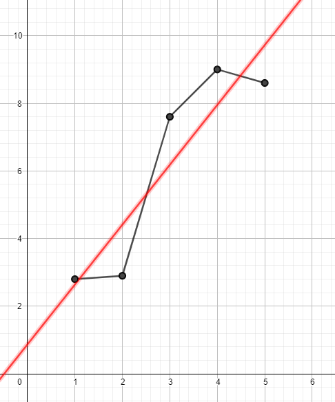

# Usage
**Build:** `$ g++ *.cpp -o build/linearRegression.exe -std=c++17 -Wall -Wextra -Werror -pedantic`  

**Execute:** `$ ./build/linearRegression.exe`

# Linear Regression
Linear regression relies on a linear relationship between to parameters. It creates a line of best fit. It aims to predict an output of a linear relationship for a certain input.  

The line of best fit is of the mathematical form:
> f(x) = ax + b

We obtain the line of best fit through optimization where we minize the error between data points and the line of best fit.  
Least squares minimizes the square of the distance between the data points and the line. The minimum is obtained when the gradient is 0.  

Gradient descent is a way of finding the minimum of a function. It is done as such:  
- Compute the gradient of the error function.  
- Calculate the coefficients using gradient descent.  
- Execute the algorithm to test the results.

#### Training dataset

#### Line of best fit for the dataset

